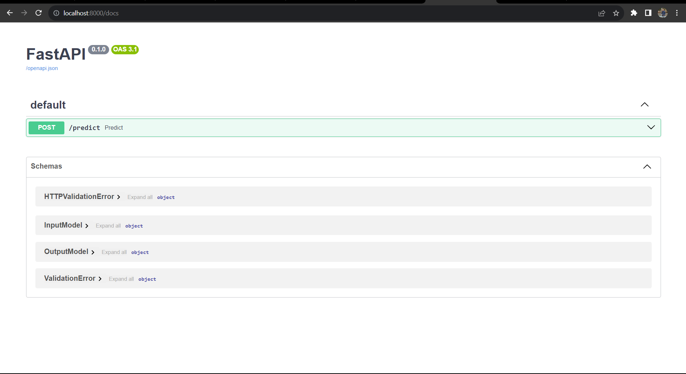
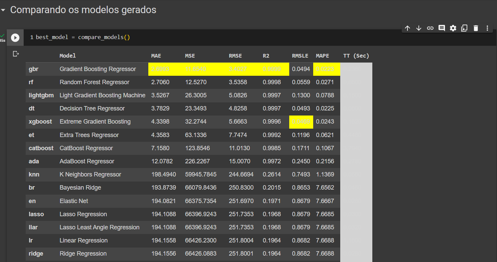
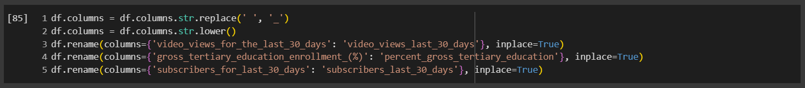

# Rank de Canais do YouTube

Este projeto consiste em um modelo de aprendizado de máquina pré-treinado para prever métricas de engajamento para canais do YouTube com base em determinados parâmetros de entrada. Ele fornece um endpoint de API para fazer previsões.



## Tecnologias Utilizadas

- Python
- FastAPI
- pycaret
- uvicorn
- Docker

## Modelo de Machine Learning

- O modelo de machine learning foi treinado utilizando a biblioteca pycaret, que é uma biblioteca de aprendizado de máquina de código aberto e de baixo código em Python que automatiza o fluxo de trabalho de aprendizado de máquina. Ele contém implementações de mais de 50 algoritmos de aprendizado de máquina supervisionados e não supervisionados.
- Seguindo a indicação do pycaret, o modelo escolhido foi o Gradient Boosting Regressor, que é um algoritmo de aprendizado de máquina supervisionado que realiza a regressão de um número arbitrário de modelos de árvore de decisão. A saída do modelo é a média ponderada das previsões de cada modelo de árvore individual.



## Pré-processamento dos Dados

Na fase de pré-processamento dos dados, foram realizadas as seguintes etapas:
1 - remoção de todas as colunas, para facilitar a manipulação dos dados:


2 - verificação do dataset, com:
    a - df.shape
    b - df.columns
    c - df.info()
    d - df.dtype
    e - df.isnull().sum()
3 - A partir dos dados anteriores, apliquei label encoder para as colunas que continham dados categóricos, e normalizei os dados numéricos para as colunas:
    a - country
    b - channel_title
    c - category

4 - Substituir os nulos por 0
5 - Dropar os nulos
6 - Dropar os duplicados
6 - Dropar as colunas a não serem utilizadas, sendo elas:

``'youtuber', 'unemployment_rate','lowest_monthly_earnings', 'highest_yearly_earnings', 'lowest_yearly_earnings','highest_monthly_earnings','title', 'abbreviation', 'latitude', 'longitude', 'created_year', 'created_month', 'created_date', 'urban_population', 'percent_gross_tertiary_education', 'population'``

## Como Executar o Arquivo Python

1. Certifique-se de que você tem o Python instalado em sua máquina.
2. Instale os pacotes Python necessários executando o seguinte comando em seu terminal:
   ``   cd src/``

``pip install -r requirements.txt``

3. Carregue o modelo pré-treinado executando o seguinte comando:

``python main.py``

4. A aplicação FastAPI iniciará a execução, e a API estará acessível em `http://127.0.0.1:8000`.
5. Você pode fazer previsões enviando uma solicitação POST para `http://127.0.0.1:8000/predict` com os dados de entrada necessários.
6. Ou acessar a documentação da API em `http://127.0.0.1:8000/docs`

### Como Rodar usando Docker Compose

Certifique-se de que você tenha o Docker e o Docker Compose instalados em sua máquina antes de prosseguir.

1. **Clone o Repositório:**

   ```
   git clone https://github.com/gustavofdeoliveira/ML-Ponderada .git
   cd Todo
   ```
2. **Rodando o Docker Compose:**

   - No diretório raiz do projeto, onde está o arquivo `docker-compose.yml`, execute o comando:
     ```
     docker-compose up
     ```

   Isso criará o container para o modelo e o serviço estará disponível na seguinte URL:

   - Modelo API: http://localhost:8000/docs
3. **Parando os Serviços:**
   Quando quiser parar os serviços, vá para o terminal onde o `docker-compose` está rodando e pressione `Ctrl+C`. Para remover os containers e redes, execute:

   ```
   docker-compose down
   ```

## Dockerhub

- O projeto foi publicado no dockerhub, e pode ser acessado através do link: ``https://hub.docker.com/repository/docker/gustavofdeoliveira/ml-ponderada``

### Executar o Container
1. Para executar o container, basta executar o comando: ``docker push gustavofdeoliveira/ml-ponderada:latest``
2. Executar o container: ``docker run -p 8000:8000 gustavofdeoliveira/ml-ponderada:latest``

## Validação de Funcionamento do Modelo

[https://drive.google.com/file/d/1Sg_CTeTdsnAT8ACmOlhOumNV27lmKz5Q/view?usp=sharing](https://drive.google.com/file/d/1Sg_CTeTdsnAT8ACmOlhOumNV27lmKz5Q/view?usp=sharing)
